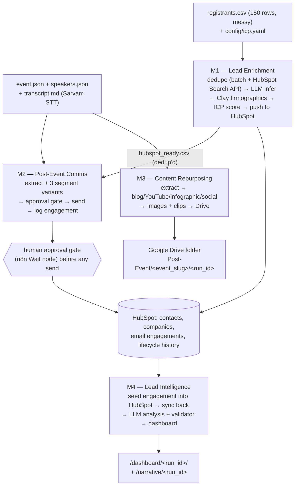
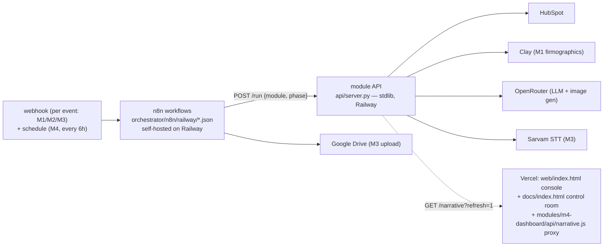

# Architecture

What feeds what, module by module, and how the pieces are wired together
today. Full endpoint/phase contract: [`docs/module-api.md`](module-api.md).
Deploy steps: [`docs/deploy-module-api.md`](deploy-module-api.md). n8n
workflow detail: [`orchestrator/n8n/railway/README.md`](../orchestrator/n8n/railway/README.md).

## Data flow

Reading it: M1 is the only module that writes to HubSpot's contact/company
records — M2 and M4 both trust what it wrote rather than re-reading the raw
registrant list. M3 has zero dependency on M1/M2 — it works straight off
the transcript. M4 is the sink: it seeds this event's engagement stream
into HubSpot itself, then reads the portal back (M1's push, its own seed,
and whatever `emails` objects the portal holds), so it can't produce a
meaningful dashboard until M1 has run at least once. The M2 leg of that
read is empty in practice: **no email has been sent**, and the only
`emails` object in the committed snapshot is a logger probe.

## How it runs today

Live is the default lane end to end — every module calls its real backend
(HubSpot, Clay, OpenRouter, Sarvam) unless a run explicitly
asks for the offline lane. The Google Drive leg is wired but has never run:
no OAuth credential is connected and `manifest.json.shared_drive` is empty (`--offline` on the module CLIs, `"live": false`
on the module API). Offline replays a labelled fixture and makes zero
network calls; it's the fallback, not the demo default.

`api/server.py` is the one process that shells out to each module's real
script (`enrich.py`, `comms.py`, `repurpose.py`, `dashboard.py`) — n8n never
calls a module script directly, only this HTTP layer. The orchestrator this
package ships is self-hosted n8n on Railway — the four workflows under
`orchestrator/n8n/railway/` — and **none of them has been imported into a
running n8n instance**. For a walkthrough with no n8n at all, the local
equivalent of the same DAG is
`python3 orchestrator/run_pipeline.py --offline --out out/replay`.

Each module owns its own LLM-call helper rather than sharing one chokepoint
script. Primary path is OpenRouter (`OPENROUTER_API_KEY`, read from env or
`~/.config/postevent/llm.env`, never printed); M1 and M2 additionally try
`claude -p` first when `LLM_BACKEND=auto`, falling back to OpenRouter — both
strip `USER` from the subprocess environment before that call, since
`claude -p` 401s against keychain auth otherwise.
