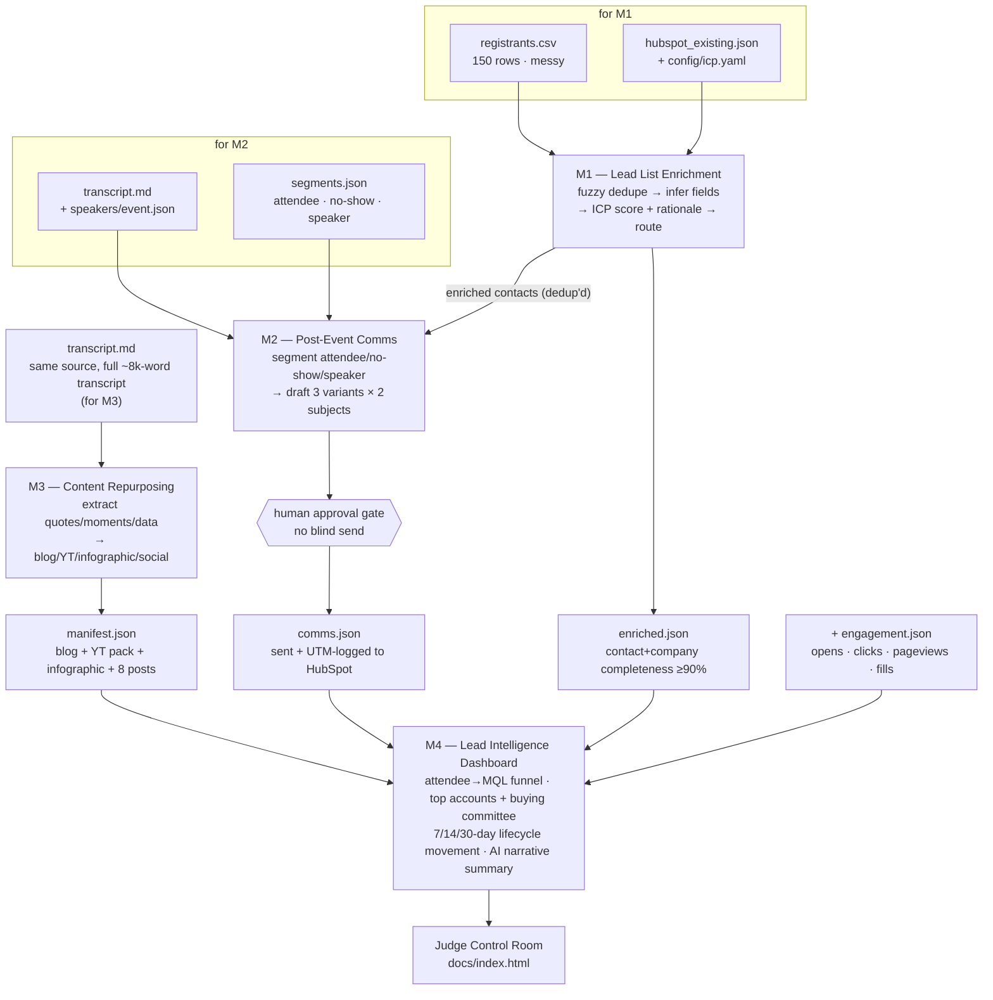
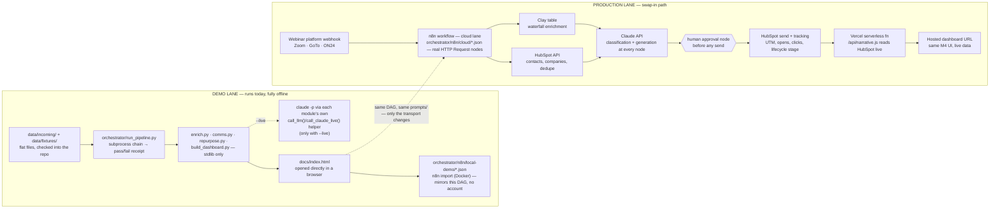

# Architecture

Two diagrams. The first is the data DAG: what feeds what, module by module, ending
at this control room. The second is the honest two-lane story — the lane that
actually runs today (local, offline, stdlib Python) next to the lane it swaps
into on a real account (n8n + Clay + HubSpot + Vercel), same DAG underneath.

Both are reproduced in `docs/index.html` as `<pre class="mermaid">` source (portable —
paste into any Mermaid renderer or Claude artifact) and as hand-drawn inline SVG
(what actually renders in that page, zero dependencies).

## (a) End-to-end data flow

Reading it: M1 is the only module that touches HubSpot's existing contact
records — everything downstream trusts its dedup, not the raw registrant list.
M2 personalizes off M1's enriched output, not the messy CSV. M3 is the one
module with zero dependency on M1/M2 — it works straight off the transcript,
which is why it's the one guaranteed to produce something even if enrichment
or comms fail. M4 is the sink: it can't run meaningfully until the other three
have produced at least one artifact each, plus engagement data that only exists
once the emails have actually gone out and been opened.

## (b) Demo lane vs. production lane

The two lanes share every prompt in every module's `prompts/` dir, the same
four-module boundary, and the same human-approval gate before any send. The
only thing that changes crossing from left to right is *where the bytes live*
— flat files become HubSpot/Clay records, a Python subprocess chain becomes an
n8n workflow, and the dashboard goes from "open a file" to "hit a URL that
recomputes on load." Nothing about the reasoning changes; that's the point of
building offline-first — the swap is a transport change, not a rewrite.

n8n itself is two-lane too: `orchestrator/n8n/local-demo/*.json` imports into
a local n8n (Docker, no account) and mirrors the exact same stdlib DAG the demo
lane runs — it's a second way to watch the same logic execute, not a
different pipeline. `orchestrator/n8n/cloud/*.json` is the production lane —
real HTTP Request nodes hitting Clay, the HubSpot API, and the Claude API,
gated behind actual credentials.

There is no shared workspace-level chokepoint script for LLM calls in this
repo. Each module — M1's `enrich.py`, M2's `comms.py`, M3's `repurpose.py` —
owns its own `call_llm()` / `call_claude_live()` helper that shells out to
`claude -p` directly. All of them strip `USER` from the subprocess
environment before the call, since `claude -p` 401s against keychain auth
otherwise — that quirk is per-module, not centralized.
